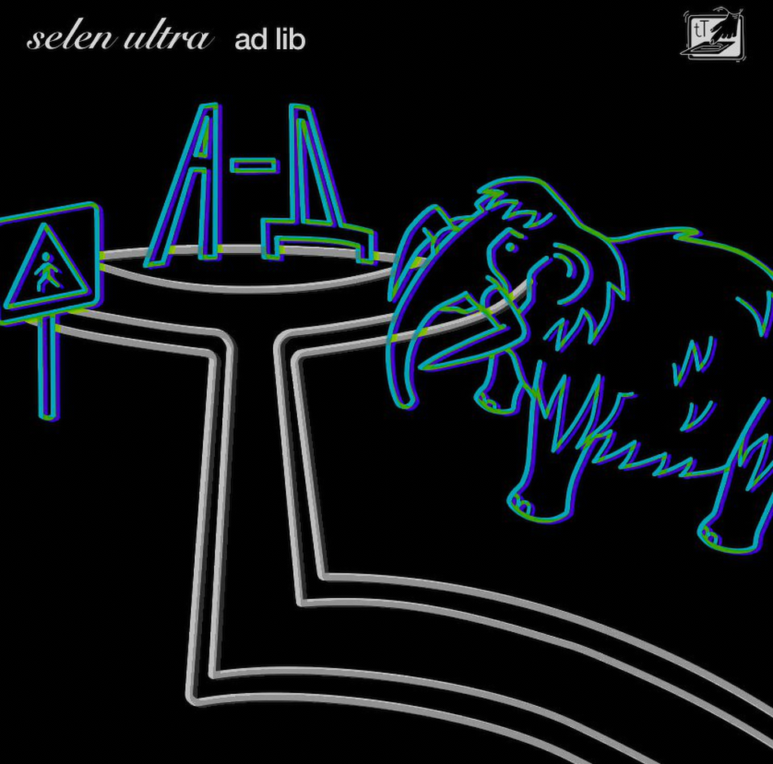
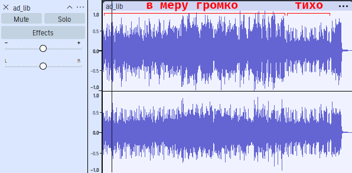

# ad lib: Write-up

Слушаем песню о нелёгкой судьбе лирического героя.

Смотрим на метаданные. Там текст трека:

```
$ ffprobe ad_lib.mp3
Input #0, mp3, from 'ad_lib.mp3':
  Metadata:
    title           : ad lib
    artist          : selen ultra
    track           : 1/1
    album           : ad lib – 10th ugorian anniversary (Single)
    genre           : Hip-Hop/Rap
    composer        : selen ultra
    album_artist    : selen ultra
    encoder         : Lavf60.16.100
    TCM             : selen ultra
    OriginalMedia   : True
    lyrics-eng      : я играл в майнкрафт
                    : случайно попал в ад
                    : ну дела
                    : это не югра
                    :
                    : я проваливаюсь вниз
                    : очень горячо и очень глоубоко
                    : бедные мамонты почему вы тут
                    :
                    : но я поднял голову наверх
                    : якубович шлет мне привет
                    :
                    : победа из побед
                    : победа из побед
                    :
                    : аааа ааа аааа
                    :
                    : защита
                    : защита
                    : защита
```

Картинка такая:



В них потеницально что-то может быть. Но не сегодня. А где ещё? Говорят же, что послание в сигнале. 

Полезно посмотреть на сам трек глазами: откроем его в аудиоредакторе типа Audacity. Иногда послания [скрывают в спектрограмме,](https://course.ugractf.ru/stegano/audio.html) но такие послания обычно заметны на слух. В глаза бросается то, что сперва бросилось в ухо (если так можно выразиться): разница в громкости.



Перепад громкости вряд ли объясняется художественной задумкой: одно дело, когда на 37-й секунде обрывается инструментал на пару тактов, чётко и ритмично усиливая вокальную партию. Это приём, которым оформлен драматический надрыв в моменте. Совсем другое дело — фрагмент в конце, выделенный на картинке выше. В нём вообще всё становится сильно тише, а потом резко возвращается на прежний уровень. Уши подскажут, что изменение громкости происходит ещё и мимо ритмической сетки.

Что же там? Усиление сигнала не помогает. Даже если делать её эквалайзером, точечно усиливая разные части частотного спектра (низкие, средние, высокие частоты трека).

Может, секрет буквально между строк? В дорожке их две: левая и правая. Для левого и правого уха соответственно.

> **Интересный факт!** С точки зрения любой стереосистемы сигнал для левого уха воспроизводится правым динамиком, а сигнал для правого — левым. Этот факт никак не относится к решению задачи.

Заметим, что левая дорожка даже в громкой части ощутимо громче, чем правая дорожка, но в той самой «тихой» части их громкость становится одинаковой. Что-то здесь не так.

В последние годы всё чаще в наушниках и автомобильных аудиосистемах применяется технология так называемого *активного шумоподавления*: шум фиксируется микрофонами и в реальном времени подаётся на динамики в противофазе. Шум и антишум отменяют друг друга, так как до уха доходит сумма сигналов, а в каждый момент времени амплитуда шума примерно противоположна амплитуде антишума. Картинка ниже объясняет этот принцип без лишних слов.


Что, если флаг зашумоподавили?

Давайте разобьём один стерео-трек на два монофонических. В Audacity: *Три точки справа от названия дорожки → Split Stereo to Mono.* Теперь инвертируем по фазе одну из дорожек (любую): `Effects → Special → Invert`. Что-то есть! Голос. Аккуратно повысим громкость (важно, чтобы уровень громкости обеих дорожек был одинаков, иначе голос снова пропадёт.

Вот он он!

> Не обращайте внимание, что это видео — в марте 2025 года «Гитхаб» не позволяет встраивать в текст аудио, поэтому автору пришлось перекодировать MP3-файл в видео со звуком и без картинки. Такие дела.

https://github.com/user-attachments/assets/4f0b8860-74eb-4d5f-b2b2-d2400a9d3f9d

Флаг: **ugra_one_is_not_enough_bring_your_friends_9b2621e0**
