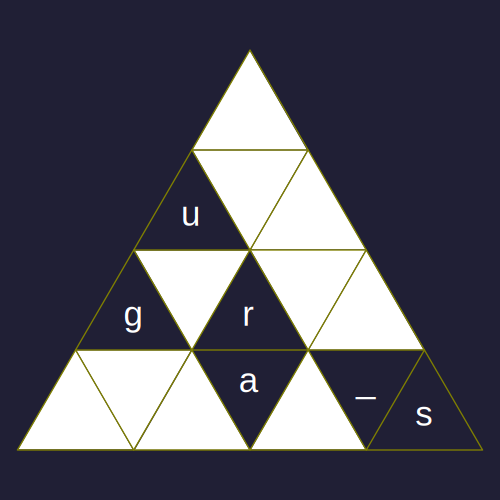

# Решётка: Write-up

Дан треугольник.

Название вполне однозначно отсылает к классическим [шифрам с использованием решёток](https://ru.wikipedia.org/wiki/%D0%A8%D0%B8%D1%84%D1%80%D0%BE%D0%B2%D0%B0%D0%BB%D1%8C%D0%BD%D0%B0%D1%8F_%D1%80%D0%B5%D1%88%D1%91%D1%82%D0%BA%D0%B0), самый популярный из которых называется *Решёткой Кардано* в честь придумавшего её итальянского математика Джероламо Кардано.

Однако на изображении мы видим не квадрат, а треугольник. Попробуем применить ту же механику, но с треугольным трафаретом.

Ключа — то есть самого трафарета — нам не дано. Придётся подбирать самостоятельно. Заметим, что в треугольнике ровно по одному разу встречаются буквы `u`, `g`, `r` и `a`. Прикинем, какая форма трафарета тут может быть.

Сначала выберем ориентацию первой части шифротекста. Закроем пока что все буквы кроме `ugra`. Среди всех ориентаций треугольника правильно читаться в порядке сверху вниз слева направо они будут только в изначальной ориентации треугольника. После `a` идёт подчёркивание, из двух таких символов в треугольнике нам подходит только тот, что в правой нижней части. Сделаем дырку и на этом месте решётки.

Кроме этого, в нашей решётке ещё должна быть дырка в угловом символе. Из трёх уголков подходит только правый нижний: две других позиции «сломают» слово `ugra`. Таким образом, получаем вот такую решётку и начало флага `ugra_s`:

Повернув нашу решётку два раза на 120 градусов, можем прочитать флаг целиком. Стоит отметить, что буква `r` будет в каждом повороте — это нормально.

Флаг: **ugra_score_tbxrxcp**
