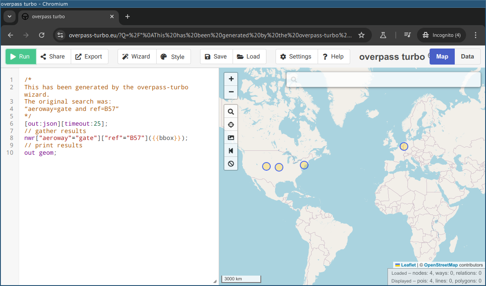
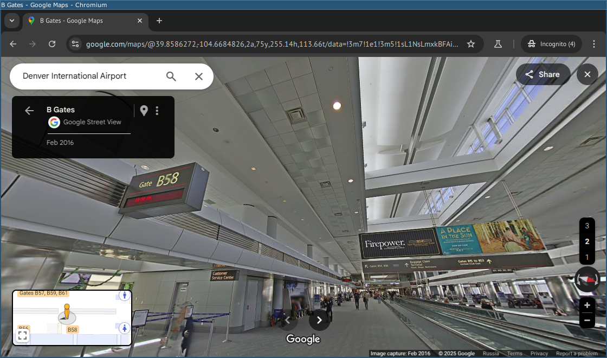
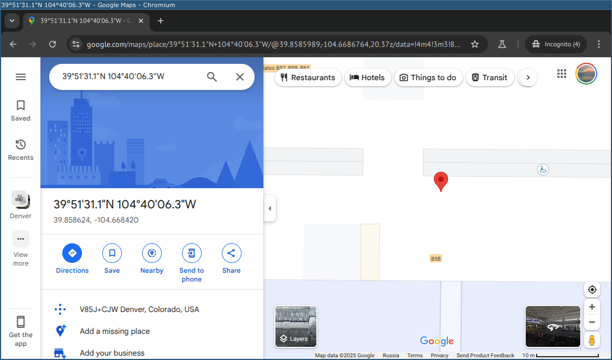
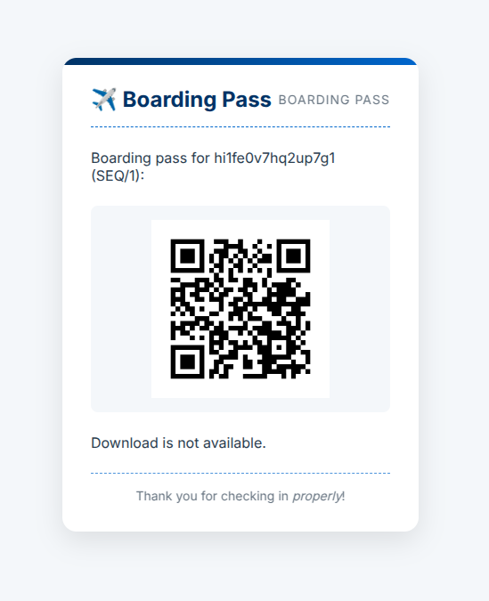

# Но обещал вернуться: Write-up

На [изображении](attachments/IMG_0799.jpg) видим надписи _B57_ и _B56_; если приглядеться, в отдалении можно заметить _B54_. Общая обстановка и тематика задания намекают, что это аэропорт. Причём аэропорт немаленький, иначе в таком сложном и большом номере выхода не было бы необходимости.

Поищем аэропорты, в которых есть выход _B57_. Можно просто текстовым поиском: [[b57 airport gate](https://www.google.com/search?q=b57+airport+gate)]. А можно [сделать запрос к OpenStreetMap](https://overpass-turbo.eu/s/1ZUb):

Так или иначе, подходящих аэропортов немного. Поискав их интерьеры, поймём, что фото сделано в терминале B аэропорта Денвера (штат Колорадо, США). [На Google Maps](https://www.google.com/maps/@39.8586274,-104.6689365,20z) прорисованы внутренности помещений и даже есть Street View. Осталось установить точку поточнее.

_B57_ находится справа, а _B56_ и _B54_ — слева, то есть камера направлена на запад. Посчитаем потолочные ниши: их видно пять, причём пятая видна так, что понятно, что точка съёмки — примерно там, где она заканчивается, и начинается шестая. По панорамам уточняем, что это прямо возле выхода _B58_:

Человек стоит почти в центре — судя по всему, возле траволатора, хотя возможно, и на нём (но это уже точно не 10 метров погрешности).

Вводим ответ _39.858624, -104.668420_ и получаем такой как бы посадочный талон:

Флаг: **ugra_[how_are_you_feeling](https://www.youtube.com/watch?v=5UAM-ZKBcZs&t=3080s)_o0he5qm8n0xov4**

<!-- Бонус: [карта всех попыток сдать задание](). -->