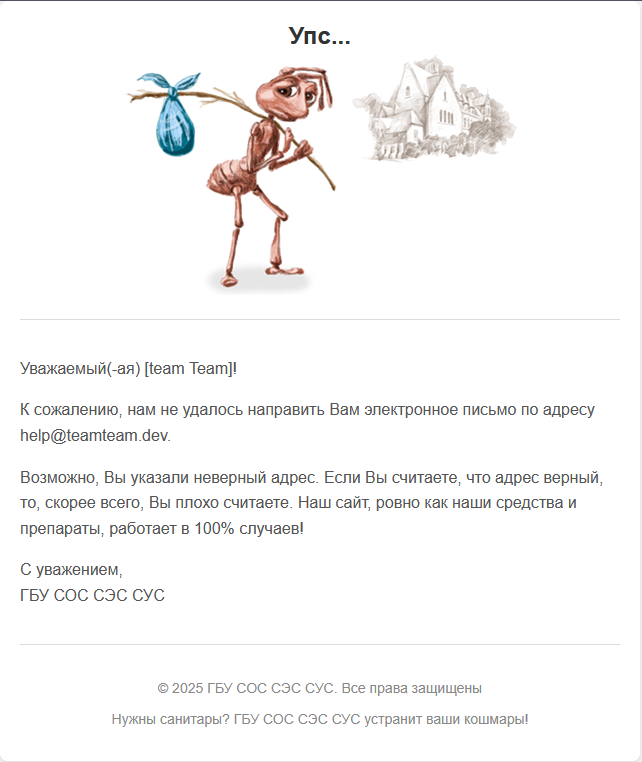
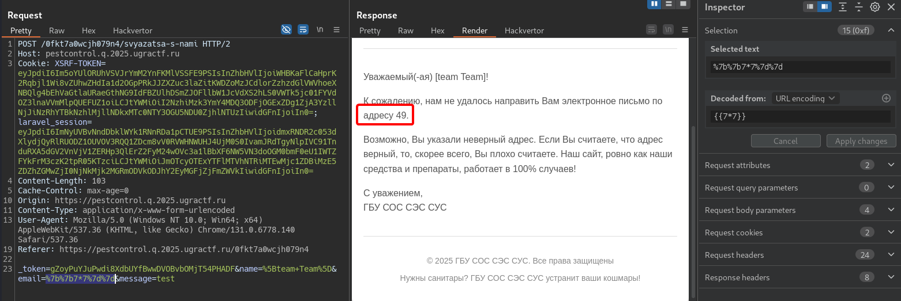
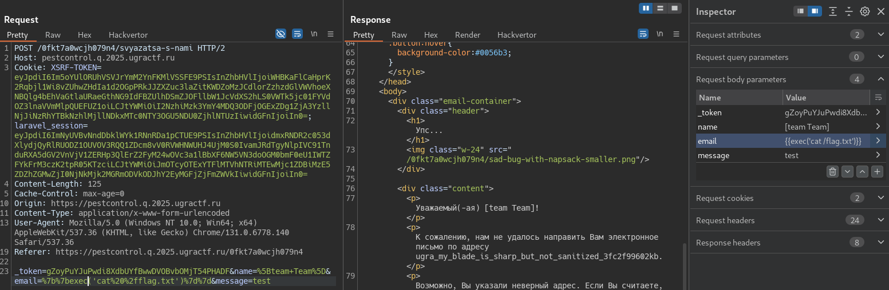

# Санэпидемстанция: Write-up

Нас встречает лендинг службы ГБУ СОС СЭС СУС, предлагающей свои услуги по защите от насекомых и иных вредителей. Единственный доступный функционал сайта — заполнение и отправка формы. Видимо, это нам и нужно сделать, чтобы в офис приехал дезинсектор. Пробуем:

Кажется, у санэпидемстанции проблемы с почтовой инфраструктурой, причём признаваться в этом она не хочет и вместо этого обвиняет лично нас.

Тут стоит обратить внимание на то, что параметры `name` и `email`, указываемые в форме, отражаются в ответе сервера. Можно почитать о том, какие уязвимости основаны на отражении пользовательского ввода и перебрать базовые нагрузки для такой ситуации, либо же запустить какой-нибудь сканер. Так или иначе, обнаруживается, что параметр `email` уязвим к SSTI — инъекции в серверные шаблоны:

> SSTI (Server-side template injection) — это вид уязвимостей, возникающих при небезопасном использовании шаблонизаторов для генерации страниц. Уязвимость заключается в том, что пользовательский ввод не передаётся в шаблон как данные, а конкатенируется напрямую в шаблон, что позволяет использовать управляющие конструкции шаблонизатора.

Мы уже могли заметить, что имена куки `XSRF-TOKEN` и `laravel-session` явно дают понять, какие язык программирования и фреймворк используются в работе сайта — PHP и Laravel. В Laravel используется шаблонизатор Blade, и немного почитав о том, как он работает, мы можем достаточно тривиально получить выполнение команд ОС, подставляя в двойные фигурные скобки функции языка PHP, например, `system()` или `exec()`. 

Изучив таким образом содержимое файловой системы, рано или поздно находим файл `/flag.txt` в корне ФС. Читаем его и получаем флаг:

Флаг: **ugra_my_blade_is_sharp_but_not_sanitized_3fc2f99602kb**
