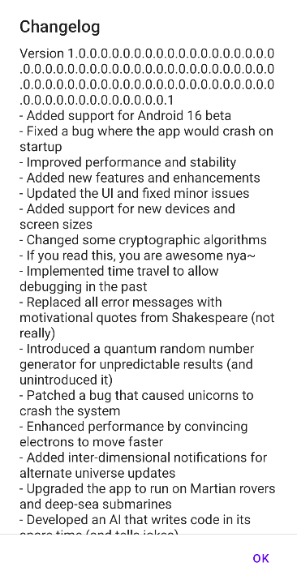

# SecuSafe: Write-up

В задании дано приложение (secusafe.apk), зашифрованный флаг (flag.enc) и пароль к нему - `1234567890`

При попытке установить secusafe.apk скорее всего получаем ошибку о том, что пакет несовместим. Интересно. Давайте попробуем понять почему. Можно воспользоваться несколькими вариантами:
1. Чтобы посмотреть логи установки и конкретную ошибку можно воспользоваться приложением [Split APKs Installer](hhttps://github.com/Aefyr/SAI). После установки приложения, выбираем secusafe.apk и смотрим логи:
    ```
    App is not installed
    Device Android version is lower than required by the package
    ```
    Рассширенный лог показывает:
    ```
    INSTALL_FAILED_OLDER_SDK: Requires development platform Baklava but this is a release platform.
    ```
2. Попробовать установить приложение по ADB:
    ```
    adb install secusafe.apk
    Performing Streamed Install
    adb: failed to install secusafe.apk: Failure [INSTALL_FAILED_OLDER_SDK: Requires development platform Baklava but this is a release platform.]
    ```

Получается что приложение собрано под странную версию Android. 2 минуты в гугле и мы находим, что Baklava это кодовое название Android 16. 

Под рукой у нас последнего Google Pixel нет, чтобы на него установить developer preview Android 16, так что  тут можно рассмотреть три варианта решения проблемы:
1. Установить эмулятор 16 андроида (например при помощи Android Studio установить AVD с Android 16)
2. Попробовать поменять данные в AndroidManifest приложения, чтобы установить его на более старую версию Android. У этого варианта есть минус, что, наверное, приложение не просто так было собрано под 16 андроид и вероятно использует какие-то фичи, которые не поддерживаются в более старых версиях и нам придется выпатчивать их. (Спойлер - так и есть)
3. Попробовать декомпилировать приложение и посмотреть, что там внутри.

Давайте попробуем пойти первым способом.
Скачиваем Android Studio, устанавливаем и создаем AVD с 16 андроидом. Устанавливаем приложение. Разрешаем ему отправлять уведомления (если не разрешить - приложение будет закрываться).
Приложение выглядит как-то так: 


Пробуем ввести данные из задания и нажать кнопку "Encrypt" - получаем сообщение "Something went wrong".

Это случается иногда, пока непонятно почему - запомнили, дальше разберемся.

Перезапускаем приложение, на этот раз появляется ченджлог: 



Внимательно его читаем, нажимаем на ОК. Попробуем ввести данные из задания еще и нажать кнопку "Encrypt". Получаем еще более длинное сообщение. Ну, наверное оно его еще раз пошифровало. Нажимаем на переключатель (наверное он переключает encrypt и decrypt), нажимаем на кнопку и... приложение вылетает.
Отлично, давайте посмотрим что в логах:
```
2025-03-09 20:01:32.359  4930-4930  Crypto                  com.rozetkin.secusafe                I  invSubBytes: state[0] = 65)
2025-03-09 20:01:32.360  4930-4930  Crypto                  com.rozetkin.secusafe                I  invSubBytes: state[1] = -124)
2025-03-09 20:01:32.360  4930-4930  Crypto                  com.rozetkin.secusafe                I  invSubBytes: state[2] = 59)
2025-03-09 20:01:32.360  4930-4930  Crypto                  com.rozetkin.secusafe                I  invSubBytes: state[3] = -25)
2025-03-09 20:01:32.360  4930-4930  Crypto                  com.rozetkin.secusafe                I  invSubBytes: state[4] = 118)
2025-03-09 20:01:32.360  4930-4930  Crypto                  com.rozetkin.secusafe                I  invSubBytes: state[5] = 97)
2025-03-09 20:01:32.360  4930-4930  Crypto                  com.rozetkin.secusafe                I  invSubBytes: state[6] = -86)
2025-03-09 20:01:32.360  4930-4930  Crypto                  com.rozetkin.secusafe                I  invSubBytes: state[7] = 103)
2025-03-09 20:01:32.360  4930-4930  Crypto                  com.rozetkin.secusafe                I  invSubBytes: state[8] = -55)
2025-03-09 20:01:32.360  4930-4930  Crypto                  com.rozetkin.secusafe                I  invSubBytes: state[9] = 60)
2025-03-09 20:01:32.360  4930-4930  Crypto                  com.rozetkin.secusafe                I  invSubBytes: state[10] = -94)
2025-03-09 20:01:32.360  4930-4930  Crypto                  com.rozetkin.secusafe                I  invSubBytes: state[11] = 99)
2025-03-09 20:01:32.360  4930-4930  Crypto                  com.rozetkin.secusafe                I  invSubBytes: state[12] = 41)
2025-03-09 20:01:32.360  4930-4930  Crypto                  com.rozetkin.secusafe                I  invSubBytes: state[13] = 57)
2025-03-09 20:01:32.360  4930-4930  Crypto                  com.rozetkin.secusafe                I  invSubBytes: state[14] = -125)
--------- beginning of crash
2025-03-09 20:01:32.360  4930-4930  AndroidRuntime          com.rozetkin.secusafe                D  Shutting down VM
2025-03-09 20:01:32.360  4930-4930  AndroidRuntime          com.rozetkin.secusafe                E  FATAL EXCEPTION: main (Ask Gemini)
Process: com.rozetkin.secusafe, PID: 4930
java.lang.ArrayIndexOutOfBoundsException: length=16; index=16
    at com.rozetkin.secusafe.ui.encrypt.EncryptFragment$Crypto.sub3(EncryptFragment.kt:279)
    at com.rozetkin.secusafe.ui.encrypt.EncryptFragment$Crypto.BlockOperation(EncryptFragment.kt:415)
    at com.rozetkin.secusafe.ui.encrypt.EncryptFragment.cryptoOperation(EncryptFragment.kt:149)
    at com.rozetkin.secusafe.ui.encrypt.EncryptFragment.onCreateView$lambda$0(EncryptFragment.kt:67)
    at com.rozetkin.secusafe.ui.encrypt.EncryptFragment.$r8$lambda$jJ7tx7ZJRx5MPYFvcjQLTTcar3c(Unknown Source:0)
    at com.rozetkin.secusafe.ui.encrypt.EncryptFragment$$ExternalSyntheticLambda0.onClick(D8$$SyntheticClass:0)
    at android.view.View.performClick(View.java:8081)
    at com.google.android.material.button.MaterialButton.performClick(MaterialButton.java:1218)
    at android.view.View.performClickInternal(View.java:8058)
    at android.view.View.-$$Nest$mperformClickInternal(Unknown Source:0)
    at android.view.View$PerformClick.run(View.java:31515)
    at android.os.Handler.handleCallback(Handler.java:995)
    at android.os.Handler.dispatchMessage(Handler.java:103)
    at android.os.Looper.loopOnce(Looper.java:239)
    at android.os.Looper.loop(Looper.java:328)
    at android.app.ActivityThread.main(ActivityThread.java:8952)
    at java.lang.reflect.Method.invoke(Native Method)
    at com.android.internal.os.RuntimeInit$MethodAndArgsCaller.run(RuntimeInit.java:593)
    at com.android.internal.os.ZygoteInit.main(ZygoteInit.java:911)
```

Из лога становится понятно, что:
1. Приложение вылетает из-за ArrayIndexOutOfBoundsException, то есть где-то в коде происходит обращение к элементу массива, которого там нет.
2. Есть упоминание о invSubBytes. Что это непонятно, давайте пока запомним такое есть.

Отлично, ну то есть смотреть что внутри приложения в любом случае придется. Для декомпиляции и просмотра кода будем использовать Jeb, но можно использовать jadx и прочие аналоги. Для того, чтобы пересобирать приложение (а это нам понадобится дальше) будем использовать плагин для VSCode - APKLab. Этот плагин совмещает в себе jadx, apktool и многое другое.

В Jeb видим следующее: 


Мы уже видели что приложение крашится в EncryptFragment, а именно в Crypto.sub3. Посмотрим что там происходит:
```java
private final void sub3(byte[] arr_b, boolean z) {
            int v = 0;
            if(z) {
                while(v < arr_b.length) {
                    arr_b[v] = (byte)Crypto.a2[arr_b[v] & 0xFF];
                    Log.i("Crypto", "invSubBytes: state[" + v + "] = " + arr_b[v + 1] + ")");
                    ++v;
                }
            }
            else {
                while(v < arr_b.length) {
                    byte b = (byte)Crypto.a1[arr_b[v] & 0xFF];
                    arr_b[v] = b;
                    Log.i("SubBytes", "state[" + v + "] = " + ((int)b));
                    ++v;
                }
            }
        }
```     

Ага, ну вот и ошибка. В первом цикле мы обращаемся к элементу arr_b[v + 1], а во втором цикле к arr_b[v]. То есть в первом цикле мы выходим за границы массива. Исправить это можно двумя способами - либо убрать +1 в первом цикле, либо просто убрать вывод лога. Давайте реализуем первый вариант. Для этого загружаем apk в APKLab, декомпилируем в smali, ищем функцию sub3 в файле `smali\com\rozetkin\secusafe\ui\encrypt\EncryptFragment$Crypto.smali`:
```smali
.method private final sub3([BZ)V
    .locals 5

    .line 276
    const-string p0, "] = "

    const/4 v0, 0x0

    if-eqz p2, :cond_0

    .line 277
    array-length p2, p1

    :goto_0
    if-ge v0, p2, :cond_1

    .line 278
    sget-object v1, Lcom/rozetkin/secusafe/ui/encrypt/EncryptFragment$Crypto;->a2:[I

    aget-byte v2, p1, v0

    and-int/lit16 v2, v2, 0xff

    aget v1, v1, v2

    int-to-byte v1, v1

    aput-byte v1, p1, v0

    add-int/lit8 v1, v0, 0x1

    .line 279
    aget-byte v2, p1, v1

    new-instance v3, Ljava/lang/StringBuilder;

    const-string v4, "invSubBytes: state["

    invoke-direct {v3, v4}, Ljava/lang/StringBuilder;-><init>(Ljava/lang/String;)V

    invoke-virtual {v3, v0}, Ljava/lang/StringBuilder;->append(I)Ljava/lang/StringBuilder;

    move-result-object v0

    invoke-virtual {v0, p0}, Ljava/lang/StringBuilder;->append(Ljava/lang/String;)Ljava/lang/StringBuilder;

    move-result-object v0

    invoke-virtual {v0, v2}, Ljava/lang/StringBuilder;->append(I)Ljava/lang/StringBuilder;

    move-result-object v0

    const-string v2, ")"

    invoke-virtual {v0, v2}, Ljava/lang/StringBuilder;->append(Ljava/lang/String;)Ljava/lang/StringBuilder;

    move-result-object v0

    invoke-virtual {v0}, Ljava/lang/StringBuilder;->toString()Ljava/lang/String;

    move-result-object v0

    const-string v2, "Crypto"

    invoke-static {v2, v0}, Landroid/util/Log;->i(Ljava/lang/String;Ljava/lang/String;)I

    move v0, v1

    goto :goto_0

    .line 283
    :cond_0
    array-length p2, p1

    :goto_1
    if-ge v0, p2, :cond_1

    .line 284
    sget-object v1, Lcom/rozetkin/secusafe/ui/encrypt/EncryptFragment$Crypto;->a1:[I

    aget-byte v2, p1, v0

    and-int/lit16 v2, v2, 0xff

    aget v1, v1, v2

    int-to-byte v1, v1

    aput-byte v1, p1, v0

    .line 285
    new-instance v2, Ljava/lang/StringBuilder;

    const-string v3, "state["

    invoke-direct {v2, v3}, Ljava/lang/StringBuilder;-><init>(Ljava/lang/String;)V

    invoke-virtual {v2, v0}, Ljava/lang/StringBuilder;->append(I)Ljava/lang/StringBuilder;

    move-result-object v2

    invoke-virtual {v2, p0}, Ljava/lang/StringBuilder;->append(Ljava/lang/String;)Ljava/lang/StringBuilder;

    move-result-object v2

    invoke-virtual {v2, v1}, Ljava/lang/StringBuilder;->append(I)Ljava/lang/StringBuilder;

    move-result-object v1

    invoke-virtual {v1}, Ljava/lang/StringBuilder;->toString()Ljava/lang/String;

    move-result-object v1

    const-string v2, "SubBytes"

    invoke-static {v2, v1}, Landroid/util/Log;->i(Ljava/lang/String;Ljava/lang/String;)I

    add-int/lit8 v0, v0, 0x1

    goto :goto_1

    :cond_1
    return-void
.end method
```
Для того, чтобы убрать +1 нам нужно заменить `aget-byte v2, p1, v1` в этой функции на `aget-byte v2, p1, v0`.

Попробуем теперь пересобрать приложение. Выбираем apktool.yml -> ApkLab: Rebuild apk. Но пересборка падает, потому как apktool не знает, что такое Baklava в версии. Поменяем 
```yaml
sdkInfo:
  minSdkVersion: Baklava
  targetSdkVersion: Baklava
```
на 
```yaml
sdkInfo:
  minSdkVersion: 35
  targetSdkVersion: 35
```

После этого пересборка проходит успешно. Используем 35 sdk, потому что до выхода релизной версии Android 16 для сборки используется предыдущая версия Android - 15 с версией API 35.
Устанавливаем, пытаемся расшифровать строчку, которую мы повторно зашифровали раньше и получаем полный бред:


Значит расшифровка все еще не работает нормально.  Если попробовать расшифровать зашифрованный флаг, то приложение снова упадеь. Посмотрим в логи:
```
AndroidRuntime          com.rozetkin.secusafe                E  FATAL EXCEPTION: main (Ask Gemini)
Process: com.rozetkin.secusafe, PID: 5982
java.lang.IllegalArgumentException: 0 > -31
    at java.util.Arrays.checkLength(Arrays.java:4086)
    at java.util.Arrays.copyOfRangeByte(Arrays.java:4130)
    at java.util.Arrays.copyOfRange(Arrays.java:4125)
    at kotlin.collections.ArraysKt___ArraysJvmKt.copyOfRange(_ArraysJvm.kt:1466)
    at com.rozetkin.secusafe.ui.encrypt.EncryptFragment.crypto1(EncryptFragment.kt:203)
    at com.rozetkin.secusafe.ui.encrypt.EncryptFragment.cryptoOperation(EncryptFragment.kt:155)
    at com.rozetkin.secusafe.ui.encrypt.EncryptFragment.onCreateView$lambda$0(EncryptFragment.kt:67)
    at com.rozetkin.secusafe.ui.encrypt.EncryptFragment.$r8$lambda$jJ7tx7ZJRx5MPYFvcjQLTTcar3c(Unknown Source:0)
    at com.rozetkin.secusafe.ui.encrypt.EncryptFragment$$ExternalSyntheticLambda0.onClick(D8$$SyntheticClass:0)
    at android.view.View.performClick(View.java:8081)
    at com.google.android.material.button.MaterialButton.performClick(MaterialButton.java:1218)
    at android.view.View.performClickInternal(View.java:8058)
    at android.view.View.-$$Nest$mperformClickInternal(Unknown Source:0)
    at android.view.View$PerformClick.run(View.java:31515)
    at android.os.Handler.handleCallback(Handler.java:995)
    at android.os.Handler.dispatchMessage(Handler.java:103)
    at android.os.Looper.loopOnce(Looper.java:239)
    at android.os.Looper.loop(Looper.java:328)
    at android.app.ActivityThread.main(ActivityThread.java:8952)
    at java.lang.reflect.Method.invoke(Native Method)
    at com.android.internal.os.RuntimeInit$MethodAndArgsCaller.run(RuntimeInit.java:593)
    at com.android.internal.os.ZygoteInit.main(ZygoteInit.java:911)
```

Теперь приложение падает в функции crypto1. Посмотрим что там происходит:
```java                                                                                      
private final byte[] crypto1(byte[] arr_b, boolean z) {
    if(z) {
        int v1 = ArraysKt.last(arr_b);
        return ArraysKt.copyOfRange(arr_b, 0, arr_b.length - v1);
    }

    int v2 = 16 - arr_b.length % 16;
    List list0 = ArraysKt.toMutableList(arr_b);
    for(int v = 0; v < v2; ++v) {
        list0.add(Byte.valueOf(((byte)v2)));
    }

    return CollectionsKt.toByteArray(list0);
}
```

В случае, если z = true, то мы берем последний элемент массива и возвращаем массив без последних v1 элементов. В случае, если z = false, то мы добавляем в массив элементы, чтобы его длина стала кратной 16. Похоже на то, что это функция добавления/удаления padding'а (вероятно PKCS#5). Реализована она верно, а значит, что если на ней падает приложение, что данные расшифровываются неправильно. И то, что приложение не упало в первый раз, когда мы зашифровали строку, говорит только о том, что нам повезло и было достаточно элементов для удаления.

Значит придется разбираться, как шифрование работает и где допущена ошибка. Вспоминаем про логи с subBytes и invSubBytes. 2 минуты в гугле и мы понимаем, что это термины из AES, а именно таблицы замен для encrypt и decrypt соответсвенно. Давайте посмотрим на то, как они выглядят в коде:
```java
int[] arr_v = {0x93, 0xAB, 0x9E, ...много байт};
Crypto.a1 = arr_v;
Crypto.a2 = ArraysKt.reversedArray(arr_v);
```
Из функции sub3 понятно, что a1 - SBox (subBytes), a2 - invSBox (invSubBytes). Таблица SBOX явно не соответствует стандартной таблице AES, но в ней содержатся все байты с 0x00 по 0xff и они не повторяются, а значит тут все хорошо. Таблица invSBox - это SBox в обратном порядке, но это как раз в AES так не работает. Давайте пересчитаем invSBox правильно:
```python
def generate_invsbox(sbox):
    invsbox = [0] * 256
    for i, byte in enumerate(sbox):
        invsbox[byte] = i
    return invsbox
```
У нас получается вот такой массив:
```java
int[] invsbox = {0x30, 0xa0, 0x97, 0x03, 0xb2, 0xd1, 0xf7, 0xa6, 0xbe, 0x0c, 0x2b, 0x2d, 0x19, 0x56, 0xc2, 0x33, 0x24, 0xb5, 0x7b, 0x6a, 0xc0, 0x84, 0x04, 0x0d, 0x1b, 0x95, 0xde, 0x43, 0xc8, 0x52, 0x5a, 0xc1, 0x9e, 0x40, 0xc7, 0xab, 0x5b, 0x3e, 0x4b, 0x39, 0xdc, 0xfd, 0x32, 0x8b, 0x59, 0x91, 0xa7, 0x6c, 0xe7, 0x13, 0x6b, 0x14, 0x74, 0x31, 0xd2, 0x9d, 0xca, 0xb0, 0xf5, 0x85, 0x06, 0x6f, 0x9a, 0x36, 0x4c, 0x8e, 0x6d, 0x4f, 0x1e, 0x07, 0xd7, 0xe6, 0xed, 0xf0, 0x61, 0x10, 0xe0, 0x78, 0x1a, 0x60, 0xb3, 0xeb, 0x1f, 0xb8, 0xc6, 0xa8, 0xef, 0xa1, 0x73, 0xcf, 0x26, 0x11, 0x35, 0x20, 0x0b, 0xf4, 0x7e, 0x7f, 0x93, 0xe1, 0x67, 0xd3, 0xff, 0x08, 0x75, 0xae, 0x4e, 0xd9, 0x88, 0x9f, 0x86, 0xc3, 0xbb, 0xce, 0x66, 0x22, 0x37, 0xf1, 0x38, 0xe4, 0x5e, 0x15, 0x94, 0xf8, 0x29, 0x3b, 0xd0, 0x18, 0xbf, 0x6e, 0xa2, 0x5f, 0x81, 0xb1, 0x69, 0xcc, 0xd4, 0x8a, 0x65, 0xd5, 0x2e, 0xe3, 0x0a, 0x27, 0x3f, 0x96, 0xfc, 0x00, 0x09, 0xac, 0x98, 0xa4, 0x89, 0x16, 0x5d, 0x0f, 0x79, 0x83, 0x02, 0x47, 0x5c, 0xea, 0x34, 0x17, 0x64, 0x8d, 0x90, 0x49, 0x3a, 0x23, 0x99, 0x01, 0xfa, 0xaa, 0xc4, 0xb7, 0x77, 0x62, 0x7a, 0x70, 0x45, 0x21, 0x41, 0x57, 0x63, 0x54, 0x76, 0x82, 0xba, 0xdd, 0x05, 0x50, 0xdf, 0x68, 0x9b, 0x1c, 0xa9, 0x7d, 0x58, 0x3d, 0xf9, 0x3c, 0x72, 0xe2, 0xdb, 0x2c, 0xf3, 0xfb, 0x53, 0xf6, 0x46, 0xec, 0x2f, 0xe5, 0x25, 0x44, 0x51, 0xbd, 0x7c, 0xe9, 0x1d, 0xb9, 0xf2, 0x9c, 0x28, 0xc9, 0xb4, 0x55, 0xbc, 0x12, 0xb6, 0xfe, 0xe8, 0x2a, 0x42, 0x4d, 0xa5, 0xcb, 0x71, 0xda, 0xa3, 0xd8, 0x4a, 0xad, 0xc5, 0x92, 0x8f, 0xd6, 0xee, 0x80, 0x8c, 0x48, 0x87, 0xcd, 0xaf, 0x0e};
```

Давайте попробуем добавить invsbox.

Все в том же файле `smali\com\rozetkin\secusafe\ui\encrypt\EncryptFragment$Crypto.smali` находим инициализацию переменных класса Crypto:
```smali
.method static constructor <clinit>()V
    .locals 1

    new-instance v0, Lcom/rozetkin/secusafe/ui/encrypt/EncryptFragment$Crypto;

    invoke-direct {v0}, Lcom/rozetkin/secusafe/ui/encrypt/EncryptFragment$Crypto;-><init>()V

    sput-object v0, Lcom/rozetkin/secusafe/ui/encrypt/EncryptFragment$Crypto;->INSTANCE:Lcom/rozetkin/secusafe/ui/encrypt/EncryptFragment$Crypto;

    const/16 v0, 0x100

    .line 221
    new-array v0, v0, [I

    fill-array-data v0, :array_0

    .line 220
    sput-object v0, Lcom/rozetkin/secusafe/ui/encrypt/EncryptFragment$Crypto;->a1:[I

    .line 228
    invoke-static {v0}, Lkotlin/collections/ArraysKt;->reversedArray([I)[I

    move-result-object v0

    sput-object v0, Lcom/rozetkin/secusafe/ui/encrypt/EncryptFragment$Crypto;->a2:[I

    const/16 v0, 0xb

    .line 230
    new-array v0, v0, [I

    fill-array-data v0, :array_1

    sput-object v0, Lcom/rozetkin/secusafe/ui/encrypt/EncryptFragment$Crypto;->unk1:[I

    return-void

    :array_0
    .array-data 4
        0x93
        0xab
        0x9e
        0x3
        0x16
        0xbe
        ... много байт
    .end array-data

    :array_1
    .array-data 4
        0x0
        0x1
        0x2
        0x4
        0x8
        0x10
        0x20
        0x40
        0x80
        0x1b
        0x36
    .end array-data
.end method
```

Добавляем еще один массив в конец:
```smali
:array_1
.array-data 4
    0x0
    0x1
    0x2
    0x4
    0x8
    0x10
    0x20
    0x40
    0x80
    0x1b
    0x36
.end array-data

# ДОБАВЛЯЕМ
:array_2
.array-data 4
    0x30
    0xa0
    0x97
    ... много байт (invsbox)
.end array-data
``` 

И теперь 
```smali
invoke-static {v0}, Lkotlin/collections/ArraysKt;->reversedArray([I)[I
move-result-object v0
```
заменяем на
```smali
const/16 v0, 0x100
new-array v0, v0, [I
fill-array-data v0, :array_2
```


Тепеь после пересборки код выглядит так:

```java
Crypto.a1 = new int[]{0x93, 0xAB, 0x9E, ...SBOX байты}; 
Crypto.a2 = new int[]{0x30, 0xA0, 0x97, ...InvSBOX байты};
```

Попробуем еще раз дешифровать, и получаем флаг

### Несколько замечаний

Можно было еще попробовать реализовать дешифрование, опираясь на алгоритм шифрования, поскольку он не падал в приложении и явно был симметричным.
Можно было посчитать, что это обычный AES EBC, не совсем так. Во первых SBOX (и InvSBOX) не стандартные. Во вторых неправильна реализована функция expand key, из-за чего результат выходит другой:

```kotlin
// Key expansion: generates an expanded key (176 bytes for AES-128)
private fun sub1(a: ByteArray): ByteArray {
    val b = ByteArray(176)
    a.copyInto(b, 0, 0, 16)
    var c = 16
    var d = 1
    val e = ByteArray(4)
    while (c < 176) {
        for (i in 0 until 4) {
            e[i] = b[c - 4 + i]
        }
        if (c % 16 == 0) {
            // Rotate left
            val t = e[0]
            e[0] = e[1]
            e[1] = e[2]
            e[2] = e[3]
            e[3] = t
            // Apply S-box
            for (i in 0 until 4) {
                e[i] = a1[(e[i].toInt() and 0xff)].toByte()
            }
            // XOR with round constant
            e[0] = (e[0].toInt() xor unk1[d]).toByte()
            d++
        }
        for (i in 0 until 4) {
            b[191-c] = (b[c - 16].toInt() xor e[i].toInt()).toByte() // <- here is the bug
            c++
        }
    }
    return b
}
```

Так же если пытаться запустить приложение на 14 андроиде и ниже, поменяв targetSDK, то приложение будет падать, так как в mainActivity используется фнкция определения причины старта приложения при помощи ApplicationStartInfo, которая появилась только в 15 андроиде. Значит ее нужно вырезать, чтобы приложение запустилось.

Так же при реализации вручную алгоритма дешифрования нужно обратить внимание, что ключ, если он меньше 16 байт (а у нас как раз это случай) неочевидно расширяется до 16 байт при помощи добавления нулей в конец. Это можно увидеть в функции `generateKey`:
```java
private final byte[] generateKey(String s) {
    byte[] arr_b = new byte[16]; // <- заполняется нулями по умолчанию
    byte[] arr_b1 = s.getBytes(Charsets.UTF_8);
    Intrinsics.checkNotNullExpressionValue(arr_b1, "getBytes(...)");
    System.arraycopy(arr_b1, 0, arr_b, 0, RangesKt.coerceAtMost(arr_b1.length, 16));
    return arr_b;
}
```

Флаг: **ugra_hey_this_is_my_secret_maybe_i_shall_use_bitwarden_instead_8nmf2lyrad2m**
